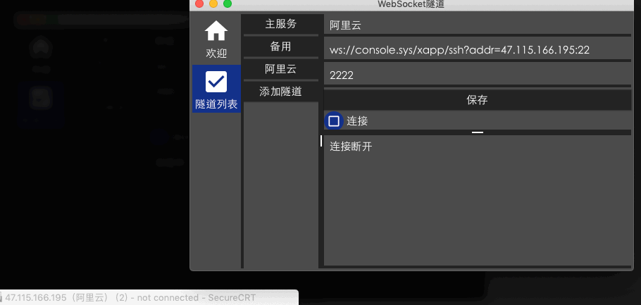

# ztun WebSocket隧道 服务端

TCP over WebSocket

```
[tcp 服务器]
 |
 |  <= TCP
 |
[ztun 服务端]
 ||
 || <= WebSocket
 ||
[nginx等]
 ||
 || <= WebSocket
 ||
[ztun客户端]
 |
 | <= TCP
 |
[tcp客户端，如secureCRT]
```

## 用法

1. 在tcp服务器端运行 zserver
1. 在本地打开ztun客户端
1. 填写监听端口和ztun的WebSocket地址
1. 测试连接

